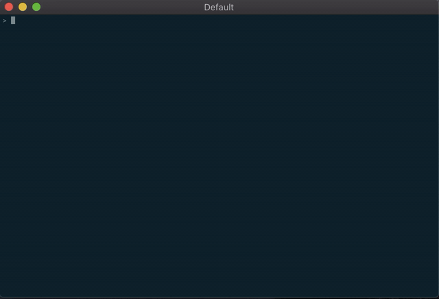

Displays Awair data on the command line. Includes conversion to Purple Air AQI scale.

Requires `arp-scan` to be installed: https://github.com/royhills/arp-scan
`brew install arp-scan` if you're on a Mac

